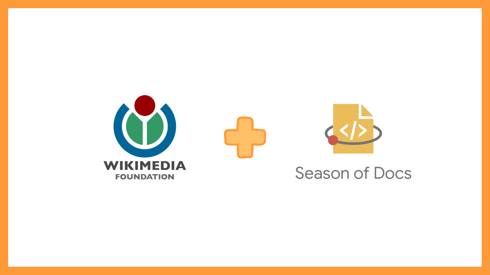


This post was written in 2019.
It is likely quite outdated, and may not reflect my current thoughts and beliefs.


 

I like working with the Wikimedia community. I got to interact with some really amazing folks and the overall experience has been wonderful! Even though Season of Docs has officially come to an end, I intend to continue contributing and would welcome interested folks to join us.

### Outreachy-19

I'll be honest here. The best part of working with The Wikimedia Foundation was helping the Outreachy applicants. I absolutely loved it! It was really nice to see so many people enthusiastic about open source software and I'm grateful to have been a tiny part of their journey. :)

I was mainly helping with the MediaWiki Action API project. We noticed that many applicants were facing similar issues, so we wrote a set of elaborate getting-started guidelines. I got to collaborate with Jerop Brenda on this, an Outreachy-18 alum and Outreachy-19 mentor, which was super fun.

### Google Code-In 2019

[Goggle Code-In](https://codein.withgoogle.com/about/) is another open source initiative that helps introduce students (aged 13-17) to open source software. I'll be co-mentoring tasks related to the MediaWiki Action API and Documentation this year. =D

### Other amazing experiences

* Ideated on a mechanism to send Wikimedia-specific Zulip welcome messages to newcomers. A lot of new contributors reach out on Zulip and it'd be helpful to automate some welcome and getting-started messages. Learn more [here](https://phabricator.wikimedia.org/T233478).

* Got to meet with Bryan Davis and Alex Paskulin (awesome folks!) to discuss ideas for a [Wikimedia Technical Conference 2019 Session on documentation](https://phabricator.wikimedia.org/T233478). It was really interesting and fun. :)
