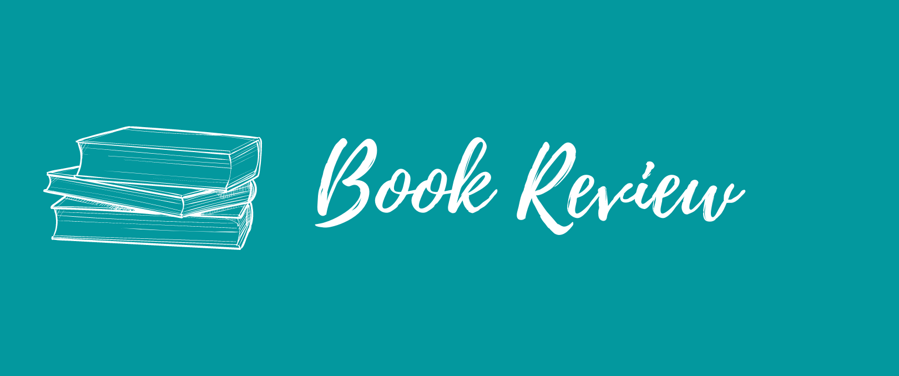


This post was written in 2020.
It is likely quite outdated, and may not reflect my current thoughts and beliefs.


One of my resolutions for 2020 is to read regularly. Reading, especially reading **books**, helps me stay centred. I find it meditative and the hours count towards my "me time".

I've read some really good books so far this year, I want to share them here.

## Becoming by Michelle Obama

This book made waves when it was released. It is definitely one of the best books I've read so far. Michelle Obama is an excellent storyteller. I'm sure everyone who reads this will relate to her experiences in some way. It was vulnerable and empowering. It was emotional and inspiring. It had surprises and humour. It was also a super easy read. I loved it, in case you couldn't tell by now. Her childhood, her family, her friends, they have shaped her values. When her school career counsellor underestimates her, we are reminded of all the people who underestimate(d) us. When she doubts herself and asks if she's good enough, we think of all the times we thought so too. When she says criticism hurts, it gives us permission to hurt too. She has always been a role model. Not just for me, but so many people around the world. With this book, we again realize why.

## My Sister's Keeper by Jodi Picoult

This is the only novel I've read in 2020 so far and it was a really nice read. It was emotional and made me think deeply about the difficult choices in life. My heart felt very heavy reading this book. I don't know what to say, I don't want to spoil it for anyone. It was heartbreaking and yet, heartwarming.

## Atomic Habits by James Clear

Many people call this a book for modern times. I agree. It is extremely easy to read, because the book is concise and to-the-point. Every sentence adds value and can stand independently. The main idea is that tiny micro-actions when performed regularly (i.e. habits) can make a huge impact. James Clear summarizes that to develop a habit, the task should be made easy, attractive, obvious and satisfying. Just like this book. It's easy to read, the ideas presented are attractive, some are even obvious, and of course, we are satisfied with the content.

## Decoding the Technical Interview Process by Emma Bostian

I got this book in a giveaway and read it the very same day. This is another book for modern times. Short, concise and uses plain English. The concepts are explained in a very friendly and digestible manner. I was familiar with most of the concepts. It was still a very nice brush-up. JavaScript was used to code the algorithms, something I hadn't seen before, so that was interesting.

## Cracking the Coding Interview by Gayle Laakmann McDowell

(You can tell I'm preparing for technical interviews. XD)

This book is a must-read for anyone looking for and applying for technical roles. Junior or Senior. It is a thorough guide that walks us through all stages of the interview, including the behavioural interview. It goes beyond just algorithms, it includes testing, systems design, databases, etc. There are also plenty of really good exercises to solve. Personally, this will be a handy reference for the foreseeable future.

## Steal Like An Artist by Austin Kleon

Lately, I've been [learning sketchnoting](https://dev.to/pavithraes/i-m-learning-sketchnoting-3c06) and I came across this book while looking for resources. It's a tiny book, with a lot of amazing diagrams and pictures. The main idea is that new ideas come from old ones. They don't spring out of nowhere. They come from past experiences. Steal like an artist means creative people steal ideas from others, they learn to present it in their own way which makes it... original. Interesting!

---

I also wrote a complete review of [Moment of Lift by Melinda Gates](https://pavithraes.me/posts/moment-of-lift-review/) and a summary of [What Got You Here Won't Get You There by Marshall Goldsmith](https://pavithraes.me/posts/book-summary-what-got-you-here-wont-get-you-there/). If you're interested, check those out too!
