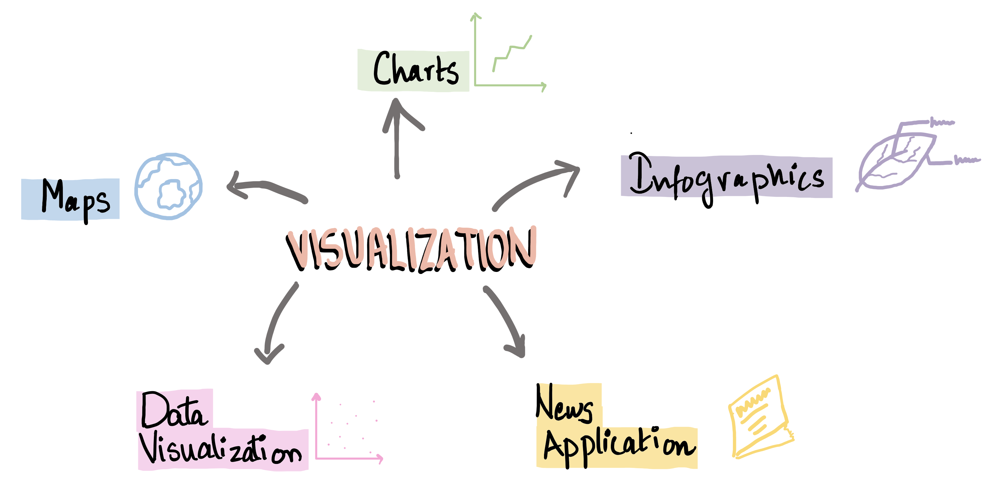
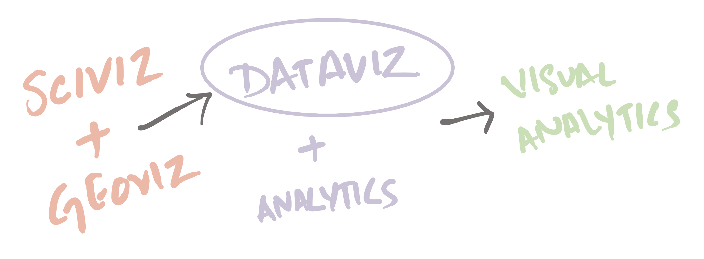
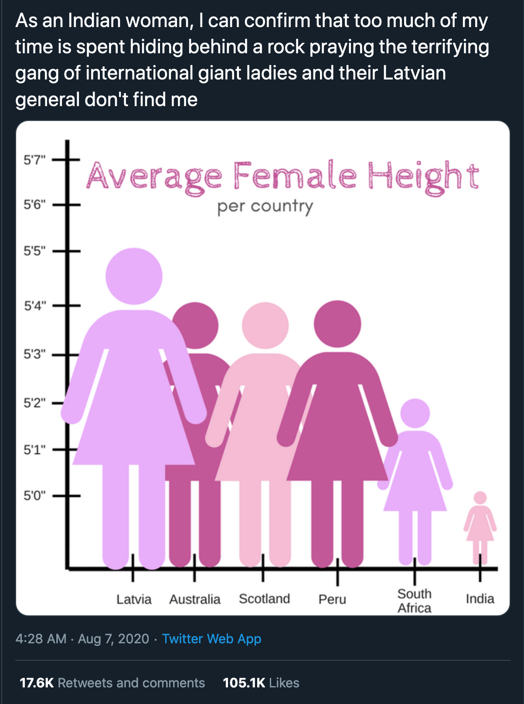
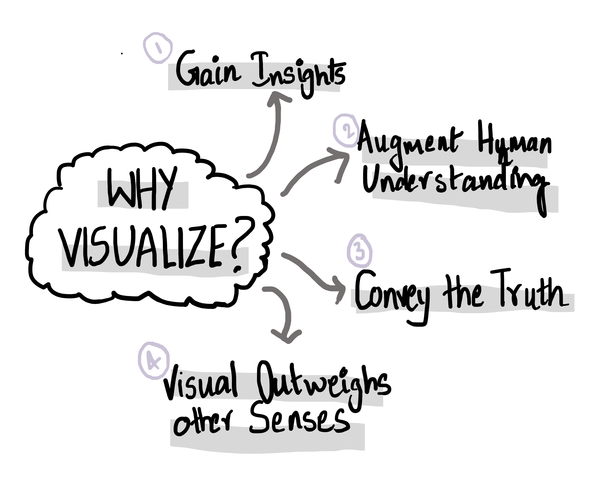

## Preface

I started planning this series to share my data visualization lecture notes. But, over the past week, it has turned into something much bigger. As I learn more about data visualization, I realized there's more I want to share.

This is not intended as a tutorial or a comprehensive guide. It is just me sharing some notes and thoughts and hoping you find it useful.

## What is Data Visualization?

In general, it is the visual representation of some data.

Right? Well... not quite. It is a little more nuanced and fascinating.

Visualization, not data visualization, just 'visualization' is a broad term. This is the visual representation of some information [1]. It can be for the purpose of exploration, analysis, etc.

Visualizations can be charts, maps, infographics, news application and data visualization.

* **Charts (aka plots and graphs):** data presented with symbols that have different shapes, colours, or sizes
* **Maps:** representation of a geographical area or data that corresponds to that area
* **Infographics:** multi-section visual representation of information intended to communicate one or more specific messages
* **News Application:** special kind of visualization that lets people relate the presented data to their own life; mostly interactive
* **Data Visualization:** display of data designed to enable analysis, exploration, and discovery

The boundaries here are not strict. In fact, these blend into each other very beautifully.

 
 

Another way to categorize is into information visualization, scientific visualization, geographical visualization.[4]

* **SciViz:** 3d objects used to represent data; often depict flows, surfaces, volumes
* **GeoViz:** 2d or 3d objects can be used to represent data; map-based; uses spacial coordinates
* **InfoViz:** deals with abstract data like hierarchies, networks and multi-dimensional spaces

**Data Visualization**, in this case, encompasses SciViz and GeoViz. Data Visualization along with Analytics forms **Visual Analytics**.

## Why Visualize?

Authors seem to agree that a primary reason to visualize data is to gain **insight**. They also agree that Data Visualization is supposed to **augment and enhance human exploration and understanding**, not replace it.

Another important reason is to **convey the truth**. 'Truth' is subjective, and we all have biases that tend to push us away from the truth line, but still, aiming for truth is a worthy goal. A step in this direction is acknowledging our inherent biases and actively trying to correct for it. It is also essential to not manipulate the graphs for personal gains - explicitly or implicitly. When I say explicitly, I mean when the visualization is wrong and doesn't present the actual information. When I say implicitly, I mean manipulating the visualizations such that a different message from the real truth is communicated, even if the data is accurate.

One example is [this tweet](https://twitter.com/reina_sabah/status/1291509085855260672) that went viral (kind of) a few weeks back:

    

The y-axis starts at 5'0'', this exaggerates the difference in heights significantly. If we *read* the chart carefully, we can tell the difference between the smallest and largest height in the chart is just 5 inches (not a lot!). Hence, this plot is misleading.

Lastly, we visualize because **human visual understanding far outweighs any other human senses**. We can take in a lot of visual information at once. We can spot similarities, differences and correlations with ease. We can also make some information pop-out.

## How Do I Learn Visualization?

This is something I had to figure out before jumping in. There seem to be different aspects of Data Visualization that I need to learn. These can also be thought of as different ways to learn data visualization.

First, we need to look at the different types of data and how they are represented. Data can be categorical, continuous, discrete, etc., and it can be represented as text, tables, images, etc. Once the data is understood, we can talk about the idioms (viz techniques) that can be used to visualize them.

Second, there are some best practices, ethics and rules for creating good visualizations. The y-axis manipulation example is just one not-so-good practice. We can talk about different idioms and explore the best practices for each. For example, the use of size, shape and colours to represent data - when to use what.

Third, we need to learn to use some data visualization tools effectively. There are many tools available. The tool of choice depends on our use case. In this series, we will mainly be working with Python - Matplotlib and Bokeh.

Finally, the more we learn, the more things there are to learn. For example, interactive plots can be explored in-depth, we can discuss the above three aspects individually for interactive plots too! I'm excited to see where this series takes us!

## References

I referred to the following books to write this blog post:

[1] The Truthful Art: Data, Charts, and Maps for Communication by Alberto Cairo
[2] Fundamentals of Data Visualization by Claus O. Wilke
[3] Data Visualization: A Practical Introduction by Kieran Healy
[4] Visualization Analysis and Design by Tamara Munzner
