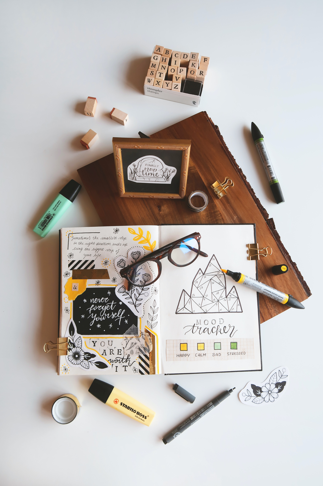

I've been bullet journaling for almost 2 years. This feels amazing to say because no other planning/organising system has worked for me for more than few weeks me. So, in this quick post, I want to share why I love bullet journaling and what my personal setup looks like.

## Wait a minute, what is bullet journaling?

In a nutshell, it is using a plain old paper notebook as your planner with one main rule: maintain an index. Everything else is up to you. Most people have a regular "spread", or template, for the year/month/week/day plans, notes, habit trackers, etc. with a task management system that works for them like checklists, kanban boards, etc. Lots of people also enjoy decorating and personalising their journals.

Here one <a href="https://unsplash.com/photos/hb00NH1JXh0">I found on Unsplash</a>:

Search for "bullet journal" on Pinterest and you'll find a variety of absolutely beautiful and creative designs. The opportunities are endless. 💫

## My setup

My bullet journaling setup is on the minimal-er side. I decorate and use colours sometimes, but mostly I keep it simple. This reduces the threshold to actually using the journal. I have a regular monthly and weekly spread.

### Monthly spread

This page doesn't have much of a function purpose. I like creating this because it serves as a natural checkpoint — not only in the journal, but also just in general. It gives me a chance to reflect and think about things I'd like to change in the coming month.

As you can see, I just have a calendar setup for September. September is a calm month for me because I took a break before starting a new role. I might write a theme on the side or add some stickers later.

### Weekly spread

This is the important spread.

I landed on this spread after many iterations, and it'll continue to change. "Daily" views were a little too granular for me, so I decided to not do it and have just a weekly view. It's also nice to have the whole week in mind while prioritising and scheduling.

I limit myself to 5 top priorities for the week and 3 top priorities for each day. If these get done, I can call my week/day a success. I use different symbols to differentiate these "priority" tasks and from other tasks.

I also keep track of meetings here. Meetings take up a significant amount of time, so it's nice to have these commitments in view while planning the tasks for the day. For example, on meeting heavy days, I might have comparatively smaller "priorities".

### Other things I use my journal for

Basically anything I want to write down. Shopping lists, habit tracking, thoughts and feelings, goals and planning, work meeting preparation, meeting notes and action items, rough blog post drafts, etc. Because I have an index to know what is where, things don't get lost in the void.

## Why a bullet journal works for me (I think)

I love the flexibility and personalisation bullet journaling offers. In my opinion, there is no "wrong" way to do it. It can also evolve and grow with me, and accommodate everything I need it to.

Bullet journaling forces me to physically re-write a task to move it to a future date. Which means I don't forget it, and there is a non-trivial amount of effort involved in moving the task. If I have moved a task ~3 times, it might mean I there is some mental/physical blocker to completing it. I can re-evaluate its priority and complexity each time I write it. I can also consider breaking it down or narrowing the scope.

As of today, I actually write faster than I type, so I'm more comfortable with pen and paper. It's also fun to use colors, stickers, and decorative tape to capture how I'm feeling sometimes. 🎨

## However…

I have my journal open on my table all the time. It's always in view and within reach. I can do this because I've been working remotely for the past couple of years. Maybe bullet journaling has worked for me for this very reason. Maybe it won't work for me when I need to travel or go into a physical office. Maybe.

However, bullet journaling has now also become a strong habit and a very important part of my day. It bring me a lot of joy and clarity. So honestly, I'm hopeful that it'll continue to work even outside of remote environments. :)

All of that said, it's obviously not a perfect system and I don't use it perfectly all the time. I'm human, so I do tend to forget things, I feel lazy sometimes, and I have rough days. Even with the super low threshold to maintain my journal, on some days I just can't, so I don't. My "week-view" sometimes has one or more blank days. The goal here isn't to do everything perfectly, the goal is to keep at it. It is okay if I miss a couple of days. I've managed to go back the day after and continue where I left off. 🌻

---

Thanks for reading! What is your planning system like? Have you used a bullet journal before? Do you have tips on how I can improve my setup? Let me know on Twitter!

**Attributions**

- Header Image: Photo by <a href="[https://unsplash.com/@jessbaileydesigns?utm_source=unsplash&utm_medium=referral&utm_content=creditCopyText](https://unsplash.com/@jessbaileydesigns?utm_source=unsplash&utm_medium=referral&utm_content=creditCopyText)">Jess Bailey</a> on <a href="[https://unsplash.com/s/photos/bullet-journal?utm_source=unsplash&utm_medium=referral&utm_content=creditCopyText](https://unsplash.com/s/photos/bullet-journal?utm_source=unsplash&utm_medium=referral&utm_content=creditCopyText)">Unsplash</a>
