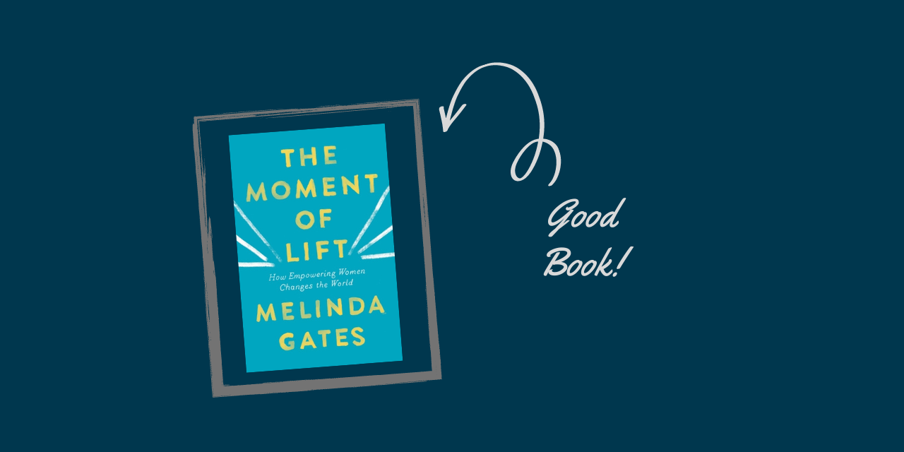

*You can buy it [here](https://www.amazon.com/Moment-Lift-Empowering-Women-Changes/dp/1250313570).*

*CW: book talks about discrimination and violence against women.*

---

This is a very powerful book by Melinda Gates. The title, "How empowering women can change the world" communicates the goal of this book effectively. Definitely one of the best books I've read so far. :)

I started reading it because I was curious. Bill and Melinda Gates are obviously popular public figures. I had read their annual letter and passively followed the news around their philanthropic work, but I was not prepared for how impactful this book would be.

Melinda Gates shares her personal stories -- how she got interested in tech, her relationship with Bill Gates, her path to equal partnership, her experiences, her learnings and more. But most importantly, she shares stories of numerous people from around the globe from different walks of life. Mothers, daughters, field workers, farmers, students, everyone.

She talks about how lifting women up, lifts the entire community up. A fascinating idea was how all social issues are connected. Poverty, disease, discrimination, all are linked to each other. One feeds the others. No problems are isolated.

Many social issues are broken down. Let's start with family planning. This included providing women access to contraceptives. The author discusses the challenges women faced, how the foundation understood the hidden hurdles and how they are making progress. Issues including child marriage, girls education, domestic violence and harmful traditions are discussed in detail. We hear stories of strong and resilient women. Women like Kakenya who traded a part of her body to get an education, and came back to her community to serve.

A very thought-provoking snippet from the book --

> Overcoming the need to create outsiders is our greatest challenge as human beings. It is the key to ending deep inequality. We stigmatize and send to the margins people who trigger in us the feelings we want to avoid. This is why there are so many old and weak and sick and poor people on the margins of society. We tend to push out the people who have qualities we’re most afraid we will find in ourselves—and sometimes we falsely ascribe qualities we disown to certain groups, then push those groups out as a way of denying those traits in ourselves. This is what drives dominant groups to push different racial and religious groups to the margins.

This tries to explain why we discriminate against women, the LGBTQ+ community, and everyone living on the margins. Why rules are made by men for women, and how that is a sign of a backward society.

The author emphasizes that empowering the people on the margins relates to lifting up their image of themselves. Love and respect play a very important role.

Another interesting idea presented was how inexperienced contributors can cause more damage than do good. The wealthy sometimes select causes to support without adequate research. This moves the focus from what actually needs to be done to what is being funded.

Many more topics are discussed in depth. One particularly sticks out to me. The author says when we hear stories of injustice, our first reaction is heartbreak, which is followed by anger. And the only way forward is acceptance. She says there is power in letting our hearts break. That is how we can feel pain without passing it on, as quoted in the book:

> The loud voice of a man who has no inner life and is a stranger to his own grief is never a voice for justice; it’s a voice for self- interest, dominance, or vengeance. Strong male voices for freedom and dignity come from men like Gandhi, King, and Mandela who mastered their pain, gave up on vengeance, and preached forgiveness.

In the end, Melinda Gates shares:

> "The goal is not for everyone to be equal. The goal is for everyone to be connected. The goal is for everyone to belong. The goal is for everyone to be loved."

In a way, I think her book embodies this vision. It connected people from around the globe, gave every story space on a stage where they belong, and carried the message of love throughout.
