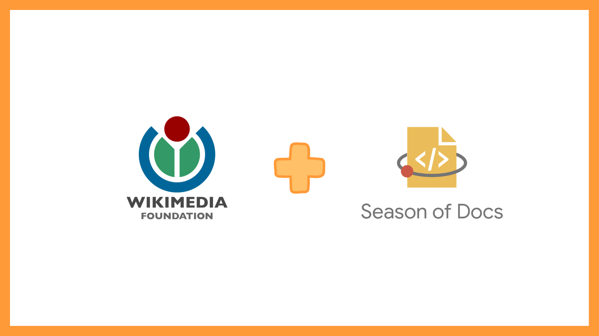


This post was written in 2019.
It is likely quite outdated, and may not reflect my current thoughts and beliefs.


 

>- **My mentor is awesome.**
>- **Setting expectations early is important.**
>- **A large portion of technical writing is research.**

I got the acceptance email! I was sooo excited and couldn't wait to get started!

**Special note:** Sarah R. Rodlund was my GSoD mentor, and she is awesome. She is super knowledgeable, kind, supportive, patient and encouraging. Genuinely. The best part, she always spreads happy energy. I came out of every meeting feeling cheerful, energized and motivated to do more. Thank you Sarah! <3

## First meeting

I was equal parts excited and nervous, but a few minutes into the meeting, I had calmed down.

We decided to start with doc development early and established an agreement to guide us through the next few months. It was so important that we set expectations early. We also discussed some personal goals that I believe we accomplished. :)

## Technical documentation

For the first half of the doc-development phase, we worked on improving the documentation for Wikimedia's technical writers.

This was an interesting project. I got the opportunity to read different open source docs and style guides. I also enjoyed learning about different technical writing genres.

It takes time to write documentation and most of it is pure research; Actual writing is the easy bit. I had overestimated the work-per-week in my original time-line, especially considering I had a lot of college commitments. We realized this early and updated our schedules accordingly.

Other documents we worked on, included writing some guidelines for prioritization of documentation tasks, text formatting templates and using graphics in technical docs.

## Toolforge and Cloud VPS

For the second half, we decided to work on improving the Toolforge and Cloud VPS documentation. I was new to this domain and it took me a few weeks to figure out the documentation layout and gain a basic understanding of Wikimedia Cloud Services. I liked it. We decided to start by working on the navigation and categories before moving on to content distribution. We created navigation sidebars for Toolforge and Cloud VPS. We also accessed the categories and namespaces of the pages. Finally, I worked on documenting some tips on developing tools with Toolforge.

I shall continue working on this project after the Season of Docs period. :)
