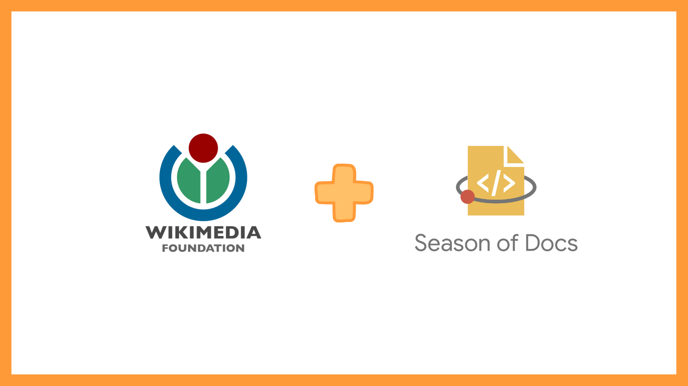


This post was written in 2019.
It is likely quite outdated, and may not reflect my current thoughts and beliefs. :)


 

>* **Persistence is sometimes more important than skill.**
>* **Jumping into the deep end is probably not a good idea?**
>* **We regret the shots we don’t take.**
>* **There are opportunities out there! For women, for everyone, we just need to reach out.**
>* **Some tips on writing good proposals.**

I was introduced to open source software and [Outreachy](https://www.outreachy.org/) in early December of 2018. For those unfamiliar with [Outreachy](https://www.outreachy.org/), it is an open-source initiative that provides internships in FOSS for under-represented folks in tech. It's pretty cool, you should check it out. :)

I was thrilled to be eligible and decided to apply. The projects were announced in January and boy were they intimidating! I went through each of them and shortlisted a few that I felt were: interesting, difficult and rewarding. Then, jumped right in.

I chose a project, took some time to read about the technologies, understand the contribution process and set up the development environment. With a lot of courage, I made my first PR -- a stupid mistake. The mentors were kind and encouraging but I felt horrible. As a college student, I was finding it difficult to manage my time, I was going through a mental burn-out at the time and I had chosen something way too difficult. I gave up. I tried looking into some GSoC projects, (there were sooooooooooo many!), but I didn’t bother applying, there were people who had started much earlier and I didn't feel qualified enough.

Thinking of it now, I think I gave up too soon.

I'm not sure how I discovered **[Season of Docs](https://developers.google.com/season-of-docs/)**, it is an initiative to involve technical writers in open source. It seemed interesting. The application period was during my Summer break and I was familiar with the application process this time, so I decided to give it a shot. But this time, I'd take it easy.

We learn from our mistakes, I chose a project that I was confident in, but it also required me to step a little outside my comfort zone -- at [The Wikimedia Foundation](https://wikimediafoundation.org/). I reached out to my mentors and started exploring. I read article and books about technical writing, listened to talks and podcasts, and also joined some community forums. It took me nearly a month to learn enough about technical writing, navigate MediaWiki effectively, understand the documentation structure and find the right resources.

In open-source initiatives like GSoD, GSoC and Outreachy, the applicant community is a major part of the learning process. Participants working on the same project can share their experiences and help each other. At Wikimedia, communications related to outreach programs take place on [Zulip chat](https://zulipchat.com/). Many interested GSoD applicants reached out, but not many seemed to continue. Looked like they were having trouble getting started, so we worked on creating a 'New technical writer guide'. I had documented my exploration phase, so creating this guide was fun. After which, I also worked on a couple of other documentation tasks. I have to mention here that the Wikimedia community was super supportive at every step. Special thanks to Sarah R. Rodlund, Srishti Sethi, Nick Wilson and Andre Klapper. =D

The final, most important step is drafting the proposal. Here's a link to [my final GSoD proposal](https://phabricator.wikimedia.org/T226018). Some tips on writing a good proposal:

* Start early. I can't stress this enough. It takes time to write a good proposal.
* Refer to previous year proposals accepted by your organization and other organizations.
* Have a clear structure in mind before beginning. Map out the different sections and what they should include.
* Be mindful about your time-line. We tend to overestimate what we can accomplish in one week.
* Finalize a draft early (1-2 weeks before the deadline) to incorporate feedback from your mentors.

The application process served as my gateway into the open-source world. I enjoyed working on the tasks and continued doing so after submitting my proposal.
