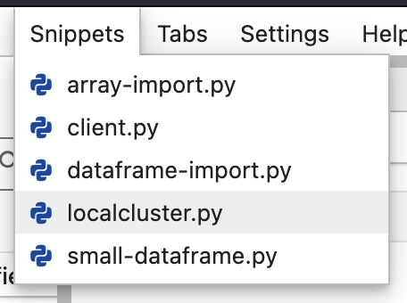
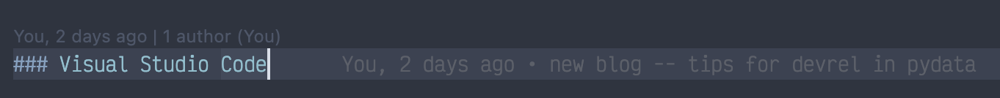
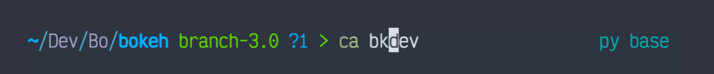
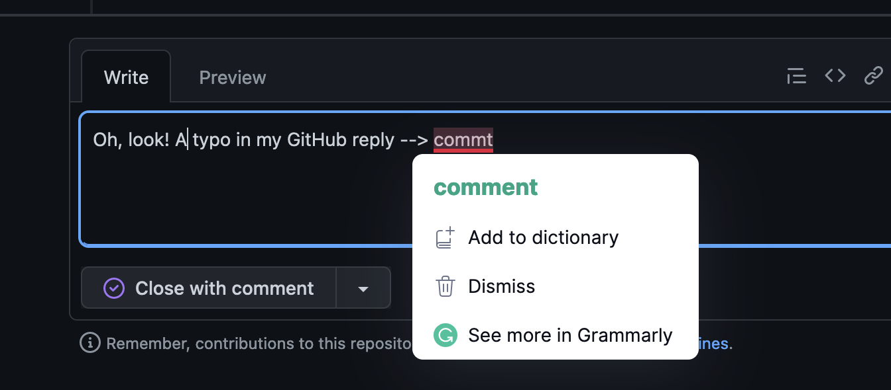
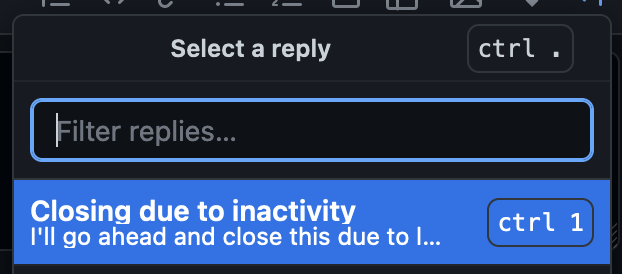
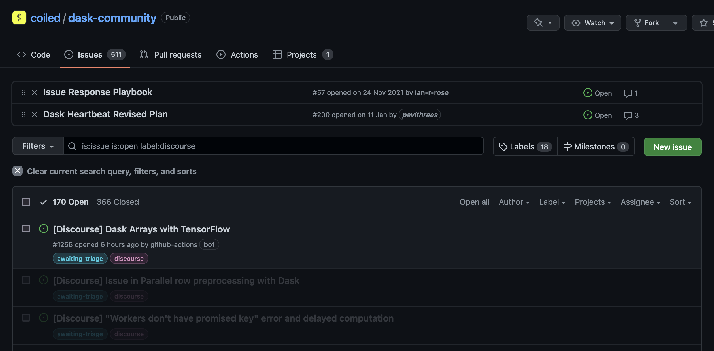

<p></p>

My full-time job at Coiled is to support the [Dask](dask.org/) community. This involves answering user question, reviewing contributor code, and maintenance activities like fixing bugs and updating the documentation. I have a few systems that make my life as a DevRel professional in the open source PyData space easier, and I'd like to share some here.

Disclaimer: These are things my friends (you know who you are, thanks!) and colleagues have shared with me very generously, and I’m just forwarding them here so more people can benefit from them. :)

## Code Editors

I use two editors on a daily basis — JupyterLab (for data science) and Visual Studio Code (for software development). The most rewarding tip with code editors is to get familiar with some keyboard shortcuts and set custom shortcuts for common operations. The following are secondary and nice-to-have’s.

### JupyterLab

I prefer using JupyterLab for data science-y work for two reasons. First, I really like the overall interface. And second, Dask has a great [JupyterLab extension](https://github.com/dask/dask-labextension) that displays the Dask dashboard in a convenient way.

It’s a powerful editor on it’s own, however, these three **extensions** have helped me a lot over the past few months:

- [jupyterlab-snippets](https://github.com/QuantStack/jupyterlab-snippets) — to quickly re-use common code snippets.

<p class="text-center"></p>

- [jupyterlab-spellchecker](https://github.com/jupyterlab-contrib/spellchecker) — to make sure markdown cells are free of typos while creating tutorials and blogs.
- [jupyterlab-code-formatter](https://github.com/ryantam626/jupyterlab_code_formatter) — to format code cells with black and isort with a single click.

### Visual Studio Code

VS Code is famous for its rich community of extension developers, and rightfully so. There are a *lot* of extensions, features, and settings that can help, but keeping the PyData+DevRel in mind, these three are must-have's:

- [Python extension, maintaned by Microsoft](https://marketplace.visualstudio.com/items?itemName=ms-python.python) has a broad range of super useful features including syntax highlighting, inline docstrings, and much more.
- [VS Code’s built-in debugger](https://code.visualstudio.com/Docs/editor/debugging) is pretty cool. I love stepping through code in a visual way. Think `pdb`, but more GUI.
- [GitLens extension](https://marketplace.visualstudio.com/items?itemName=eamodio.gitlens) brings a lot of git and version control features directly to vscode. I find the inline git blame and PR descriptions especially useful.

<p class="text-center"></p>

As a side note, I also like to keep my vscode settings sync *on.* This allows me to have a consistent development environment across vscode on my work and personal machines, as well as GitHub codespaces for smaller PRs to other projects.

### Terminal

I use the zsh shell with zplug to manage the following plugins:

- [romkatv/powerlevel10k](https://github.com/romkatv/powerlevel10k) — a minimal theme that can be customized and includes a view of the state of git version control on your directories.
- [zsh-users/zsh-autosuggestions](https://github.com/zsh-users/zsh-autosuggestions) — for autocompleting shell commands based on the command history.
- [zsh-users/zsh-syntax-highlighting](https://github.com/zsh-users/zsh-syntax-highlighting) — for syntax highlighting shell commands.

<p class="text-center"></p>

Also, **aliases**! They're the most useful part of my terminal setup! I have short aliases for especially for common `git` and `conda` commands. My choices aren't the best here, but they work for me. :)

```bash
# Conda
alias ca='conda activate'
alias cde='conda deactivate'
alias cc='conda create'
alias cecfe='conda env create -f environment.yml'
alias ci='conda install'
alias cic='conda install -c conda-forge'
alias cl='conda list'

# JupyterLab
alias jl='jupyter lab'

# Git
alias gs='git status'
alias ga='git add'
alias gcm='git commit -m'
alias gp='git push'
alias gr='git restore'
alias gc='git clone'
alias gb='git branch'
alias gch='git checkout'
```

## Browser and Search Engine

I use the Google Chrome browser and the DuckDuckGo search engine for work. I use pinned tabs and bookmarks minimally, but pretty religiously, to keep my browser organised. Here are a few notes besides that:

- [DuckDuckGo has “bangs”](https://duckduckgo.com/bang), which are shortcuts for search on different website. I mainly use this for searching on Python docs (!python), GitHub (!gh), pandas (!pandas), and (!numpy).
- I refer to some more PyData docs very often like Dask and Bokeh docs. I’ve set up !dask !bokeh, etc., as shortcuts on a browser level to quickly search through these docs too. (Chrome Settings → Search Engine → Site Search → Add)
- [Grammarly’s browser extension](https://www.grammarly.com/browser) is great to keep my spelling and phrasing correct across the various browser apps. Most of my work outside of coding involves the browser, so this works really well. :)

<p class="text-center"></p>

## GitHub

GitHub has just so many nice features and settings that can help you manage things like your project, planning, and notifications. I can't cover all of them here, but keeping my community manager hat on, I want to highlight a couple of things:

- [Saved replies feature](https://docs.github.com/en/get-started/writing-on-github/working-with-saved-replies/using-saved-replies) — I have templates for redirecting usage-questions, closing issues as resolved, pinging folks for reviews, etc. It saves me a lot of time.

<p class="text-center"></p>

- Dask has a Discourse forum for user questions. To keep track of everything on one platform, [we set up a repository to collect these issues using the corresponding RSS feeds](https://github.com/coiled/dask-community/issues?q=is%3Aissue+label%3Adiscourse+). This has worked great to help with organisation, thanks to *Ian Rose* for setting this up. :)

<p class="text-center"></p>

- [Refined Github](https://github.com/refined-github/refined-github) is a browser extension, that as the name suggests, it makes the experience of using GitHub slightly but significantly(!) smoother. It includes lots of improvements to the overall UX, and I absolutely recommend it. You can see some of these niceties in the image of GitHub above.

## Miscellaneous

A few other random things.

- [carbon.sh](http://carbon.sh) is a great free website to create pretty code snippet pictures with syntax highlighting. Make sure to add alt-text when you use that image anywhere though. :)
- I use a lot of reminders on Slack, and even keep important links bookmarked or send it to myself with a relevant note. Slack has a decent search, so I can actually find the links when I need them.
- Google docs is my “writing editor” of choice, and I’ve spent the time to learn the tool and keyboard shortcuts, as we would with code editors, and it has made a big difference.

Thanks for reading!

<hr>

**Attributions:**

- Header image by <a href="https://unsplash.com/@sadmax?utm_source=unsplash&utm_medium=referral&utm_content=creditCopyText">Amber Kipp</a> on <a href="https://unsplash.com/s/photos/speedometer?utm_source=unsplash&utm_medium=referral&utm_content=creditCopyText">Unsplash</a>
