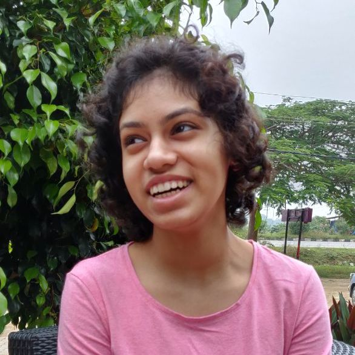

Pavithra is a Developer Advocate at [Quansight](https://quansight.com/), where she works to support the PyData community. She also contributes to the [Bokeh](https://bokeh.org/) and [Dask](https://dask.org/) projects; and has helped administrate [Wikimedia](https://wikimediafoundation.org/)'s outreach programs in the past. In her spare time, she enjoys a good book and hot coffee. :)

### Picture

### Socials

Twitter: [https://twitter.com/pavithraes](https://twitter.com/pavithraes)

LinkedIn: [https://www.linkedin.com/in/pavithraes](https://www.linkedin.com/in/pavithraes)

GitHub: [https://github.com/pavithraes](https://github.com/pavithraes)

### Name Pronounciation

<iframe width="560" height="315" src="https://www.youtube.com/embed/wCC8jMaKQLQ" title="YouTube video player" frameborder="0" allow="accelerometer; autoplay; clipboard-write; encrypted-media; gyroscope; picture-in-picture" allowfullscreen></iframe>
